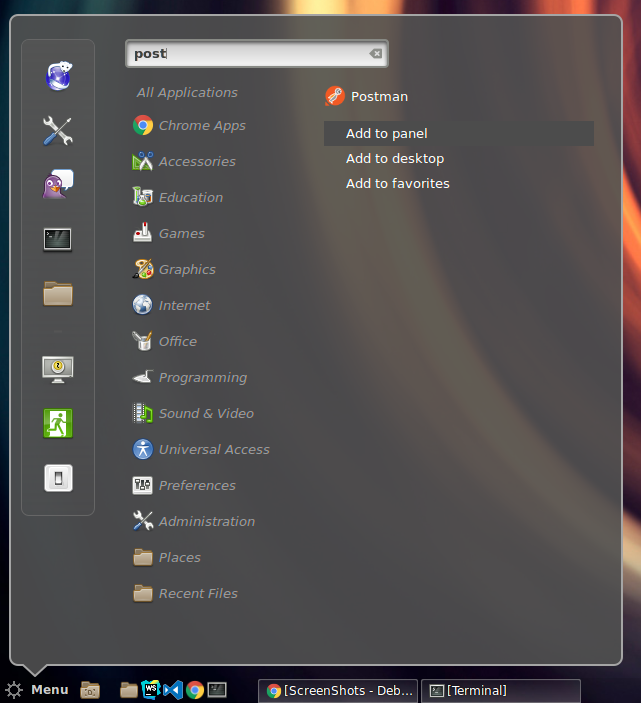
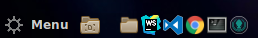
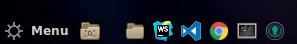

# Debian 8.x (Jessie) Cinnamon Cheat Sheet

This cheat sheet provides tips and tricks for [Debian 8.x (Jessie)](https://www.debian.org/releases/jessie/) and the [Cinnamon Desktop](https://github.com/linuxmint/Cinnamon).

## Debian 8.x
* Installing `.deb`packages: `sudo dpkg -i <package>.deb`

## Cinnamon

* Changing the style of the Panel (Taskbar):    
  Edit `/usr/share/cinnamon/theme/cinnamon.css` (`sudo`) and change the style of the `#panel` selector.

* Make Nautilus the default file manager:    
  `xdg-mime default nautilus.desktop inode/directory application/x-gnome-saved-search`

* Pin program icon to Panel / Taskbar (beneath the WebStorm / Chrome etc. icons in the screenshot):   

* Open Home folder with a keyboard shortcut (e.g. ALT+e):
  Go to `Keyboard` in `Preferences` and select `Keyboard shortcuts`. Open the `Launchers` tab and select `Home Folder`.    
  Clickt into `Keyboard bindings` and type the shortcut you want.

* Change icon spacing in quick launch:    
  default:    
  
 
  increased spacing:    
  

  Edit `/usr/share/cinnamon/theme/cinnamon.css` (`sudo`) and change the style of the `.panel-launcher` selector.    
  Add `padding-left: 7px;`
